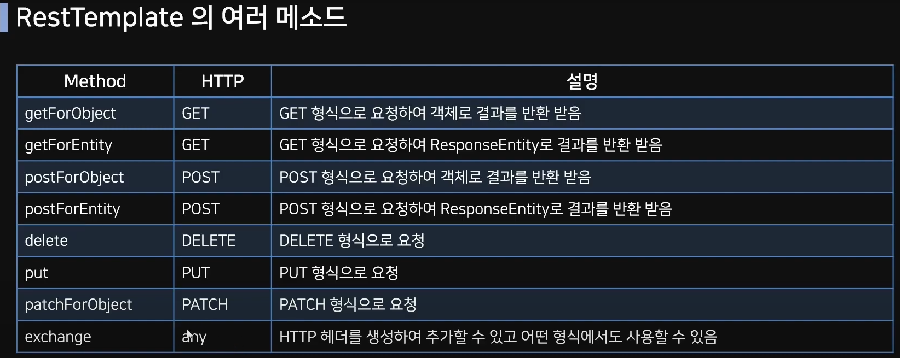

# SpringBoot-Maven

## Maven 을 이용한 백엔드 기초 공부
### 2022-08-30
1. GetController 작성
    - @RequestParam : URL 창 파라매터
2. PostController 작성
    - @RequestBody : 객체를 요청받을 때 사용
3. Swagger 라이브러리 이용 문서 작성
   - http://localhost:8080/swagger-ui/index.html
4. Product 관련 클래스 작성 
   - Entity,Dto,Service,Repository,Dao,DataHandler


### 2022-09-01
1. Logger xml 작성 후 로그 확인
   - logback-spring.xml
2. Validation 유효성 검사
   - 들어오는 데이터에 대해 의도한 형식의 값이 제대로 들어오는지 체크하는 과정
   - 입력받는 클래스에 제약조건 어노테이션을 추가한 다음 컨트롤러에서 @Valid 어노테이션 추가
3. 자바에서의 예외처리
   - **RunTime : Unchecked Exception**
     - 반드시 예외 처리 필요 
     - 컴파일 단계 (문법적 오류)
     - 롤백하지 않음
     - IOException,SQLException
   - **그 외 Exception : Checked Exception**
     - 명시적 처리 강제하지 않음
     - 실행 중 단계 (잘못된 매개변수(다른값,NULL값...)
     - 롤백함
     - NPE,IAE,IndexOUT,SystemE

3-1.SpringBoot 에서의 예외처리
- 동일 클래스 내에 @ExceptionHandler(value = Exception.class) 가 있다면 
@RestControllerAdvice 붙은 클래스보다 우선순위로 예외 적용


4. 커스텀 예외처리
    - Exception 을 상속받은 커스텀 예외 클래스(AroundHubException) 생성
    - 예외처리 필드 값(Constants 클래스) 생성
    - 컨트롤러에서 예외처리

### 2022-09-02
5. RestTemplate (**rest-template-controller** 참고)
    - **exchange**
   
    
   
- 1. 컨트롤러에 요청 URI 및 Http Method 작성 후 서비스 호출
    ``` java
        @GetMapping("/around-hub")
        public String getArdoundHub(){
            return restTemplateService.getAroundHub();
        }
    ```
- 2. 서비스에서 요청할 URI 및 경로 작성
    ``` java
        public String getAroundHub() {
        URI uri = UriComponentsBuilder
                    .fromUriString("http://localhost:9090")
                    .path("/api/server/around-hub")
                    .encode()
                    
                    .build()
                    .toUri
        }
    ```
- 3. RestTemplate 객체 생성 및 요청 결과값 자료타입 설정
    ```java
        RestTemplate restemplate = new RestTemplate();
        ResponseEntity<String> responseEntity = restemplate.getForEntity(uri, String.class);
  
        return responseEntity.getBody();
    ```
